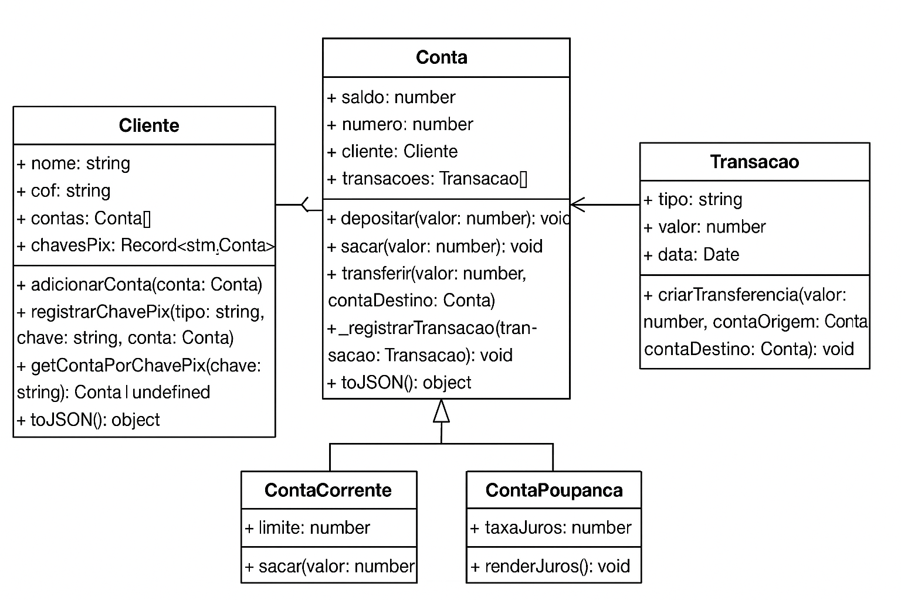

# 💳 Sistema Bancário Simplificado - O Desafio Lógico

## 📌 Descrição
Este projeto implementa a lógica de um sistema bancário em **TypeScript**, com foco em **segurança das transações** e **integridade dos dados**.  
Ele foi desenvolvido para demonstrar conceitos de **Programação Orientada a Objetos (POO)**, incluindo encapsulamento, herança, composição e boas práticas de modelagem.

---

## 🏗️ Estrutura do Projeto
- **Cliente.ts** → Representa os clientes do banco.
- **Conta.ts** → Classe abstrata para contas bancárias.
- **ContaCorrente.ts** → Extensão de Conta, com suporte a cheque especial.
- **ContaPoupanca.ts** → Extensão de Conta, com método para render juros.
- **Transacao.ts** → Representa operações bancárias (depósito, saque, transferência).
- **Pix.ts** → Implementa chaves PIX (e-mail, CPF, telefone).
- **index.ts** → Arquivo principal para rodar exemplos de uso.

---

## 🔑 Conceitos de POO aplicados
- **Encapsulamento máximo:**  
  O atributo `saldo` da Conta é privado. Alterações só ocorrem via métodos (`depositar`, `sacar`, `transferir`).  
- **Validações de negócio:**  
  - `sacar(valor)` → verifica se o valor é positivo e se há saldo suficiente.  
  - `depositar(valor)` → verifica se o valor é positivo.  
  - `transferir(valor, contaDestino)` → garante atomicidade.  
- **Relacionamentos claros:**  
  - Cliente ↔ Conta (**1:N**)  
  - Conta ↔ Transacao (**composição**)  
- **Método estático:**  
  `Transacao.criarTransferencia(...)` gera operações de débito e crédito.  
- **Serialização:**  
  Métodos `toJSON()` implementados para exportar dados sem expor informações sensíveis.

---

## 🚀 Funcionalidades
✔ Criar clientes e associar contas.  
✔ Realizar depósitos, saques e transferências.  
✔ Consultar extrato de transações.  
✔ Contas diferentes:
  - **ContaCorrente** com limite de cheque especial.  
  - **ContaPoupanca** com rendimento de juros.  
✔ Chaves PIX para transferências usando CPF, e-mail ou telefone.  

Representação em UML

+------------------+          1     *        +------------------+
|     Cliente      |----------------------->|      Conta       |
+------------------+                        +------------------+
| - nome: string   |                        | # saldo: number  |
| - cpf: string    |                        | numero: number   |
| - contas: Conta[]|                        | cliente: Cliente |
| - chavesPix: ... |                        | transacoes: ...  |
+------------------+                        +------------------+
| + adicionarConta()|                       | + depositar()    |
| + registrarPix() |                        | + sacar()        |
| + getContaPix()  |                        | + transferir()   |
| + toJSON()       |                        | + _registrarTx() |
+------------------+                        | + toJSON()       |
                                             +------------------+
                                                      ^
                                                      |
                         +----------------------------+--------------------------+
                         |                                                       |
            +---------------------+                                +---------------------+
            |   ContaCorrente     |                                |   ContaPoupanca     |
            +---------------------+                                +---------------------+
            | - limite: number    |                                | - taxaJuros: number |
            +---------------------+                                +---------------------+
            | + sacar()           |                                | + renderJuros()     |
            +---------------------+                                +---------------------+

+---------------------+
|     Transacao       |
+---------------------+
| - tipo: string      |
| - valor: number     |
| - data: Date        |
+---------------------+
| + criarTransferencia() |
+---------------------+
